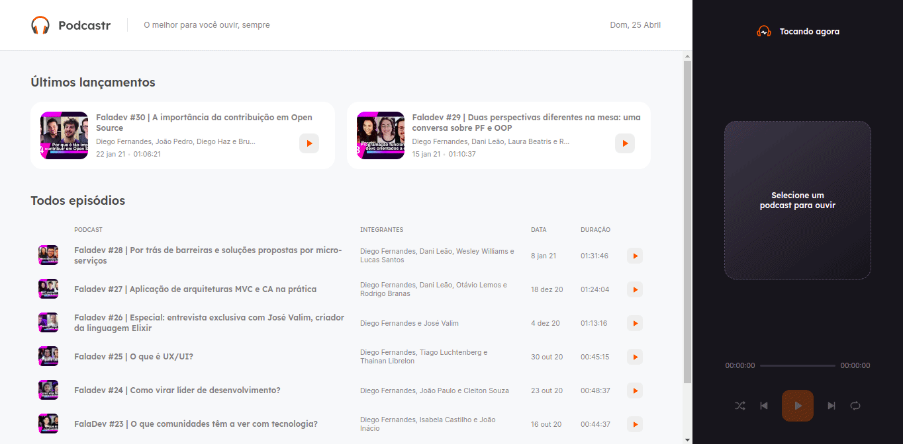

   

	

   

  <a aria-label="Completed" href="https://rocketseat.com.br/">
    </img>
  </a>

  

  

  <a href="#bookmark-sobre">Sobre</a>&nbsp;&nbsp;&nbsp;|&nbsp;&nbsp;&nbsp;
  <a href="#clapper-demonstração">Demonstração</a>&nbsp;&nbsp;&nbsp;|&nbsp;&nbsp;&nbsp;
  <a href="#rocket-tecnologias">Tecnologias</a>&nbsp;&nbsp;&nbsp;|&nbsp;&nbsp;&nbsp;
  <a href="#sparkles-como-contribuir">Como contribuir</a>&nbsp;&nbsp;&nbsp;

## :bookmark: Sobre
O **Podcastr** é uma aplicação desenvolvida para servir como site de um podcast.  
Nessa aplicação foi possível praticar técnicas como: Manuseio de áudios, geração de páginas estáticas e conexão com back-end da aplicação.

Este projeto foi idealizado pela [Rocketseat](https://rocketseat.com.br/), e desenvolvido durante a **NLW #5**.

 

## :clapper: Demonstração 

  

 

## :rocket: Tecnologias

Esse projeto foi desenvolvido utilizando as seguintes tecnologias:

- [React](https://reactjs.org)
- [TypeScript](https://www.typescriptlang.org/)
- [Next.js](https://nextjs.org/)

 

## :sparkles: Como contribuir
* Faça um fork;
* Crie uma branch com sua feature: `git checkout -b featureName`;
* Realize um Commit: `git commit -m 'feat: My new feature`;
* Faça um push para sua branch: `git push origin featureName`.
* Após o "merge" for concluído, você pode excluir sua branch.
